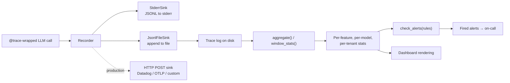

# LLM observability kit

[](https://github.com/derekgallardo01/llm-observability-kit/actions/workflows/ci.yml) [](LICENSE) [](#) [](https://codespaces.new/derekgallardo01/llm-observability-kit)

**Docs:** [Getting started](docs/getting-started.md) · [Architecture](docs/architecture.md) · [Customization](docs/customization.md) · [Evaluation](docs/evaluation.md) · [Diagrams](docs/diagrams.md) · [FAQ](docs/faq.md)

**Live demo:** [derekgallardo01.github.io/llm-observability-kit](https://derekgallardo01.github.io/llm-observability-kit/) — synthetic 1-hour production trace (646 calls, 3 features, 3 models, 2 tenants) with full dashboard: per-feature P95 latency, per-model cost, sliding-window stats, alerts fired.

Runtime observability for LLM calls: capture every call as a `Trace`,
aggregate over sliding windows (p50/p95/p99 latency + cost/hour +
error rate), fire alerts when thresholds breach.

**Vendor-neutral** — works with Claude, OpenAI, Azure OpenAI, or any
HTTP-callable model. Wrap your LLM call function with `@trace` and
every invocation becomes observable.

```bash
pip install -e .
llm-obs demo                                              # full dashboard against bundled fixture
llm-obs aggregate fixtures/production-1hour.jsonl
llm-obs windows fixtures/production-1hour.jsonl --minutes 10
llm-obs alerts fixtures/production-1hour.jsonl
```

```bash
python -m pytest -q     # 31 unit tests
python evals/run.py     # 5 golden eval cases against bundled fixture
```

Stdlib-only Python (no dependencies). `httpx` is an optional extra
for the HTTP-POST sink.

## Run in Docker

```bash
docker build -t llm-obs .
docker run --rm llm-obs                                # `llm-obs demo`
docker run --rm llm-obs pytest -q                      # tests
docker run --rm -v $(pwd):/work llm-obs llm-obs aggregate /work/traces.jsonl
```

## Example: production scenario

**[examples/slack_alerter.py](examples/slack_alerter.py)** — Scheduled alert-to-Slack pipeline: aggregate traces -> check rules -> POST fired alerts to a Slack webhook. Drop into a 15-min cron for production alerting

```bash
python examples/slack_alerter.py
```

## What it's for

Three categories of LLM-call observability questions every production
deployment hits:

1. **"How much did we spend in the last hour?"** — per-feature,
   per-model, per-tenant cost breakdowns.
2. **"What's our p95 latency for the classifier today?"** — sliding
   window percentiles, per (feature, model).
3. **"Did anything regress this morning?"** — threshold-based alerts
   on cost, latency, error rate.

The kit gives you all three with one decorator and a JSONL log.

The other LLM kits in this portfolio handle **pre-deploy** gates:
- [prompt-registry-kit](https://github.com/derekgallardo01/prompt-registry-kit) — eval-gated prompt promotion
- [azure-openai-evals](https://github.com/derekgallardo01/azure-openai-evals) — Azure deployment readiness

This kit handles **runtime** observability. Different lifecycle
phase. Compose for end-to-end LLM ops.

## The decorator

```python
from llm_observability import trace, configure
from llm_observability.tracer import JsonlFileSink

# Configure sinks at app startup
configure(sinks=[JsonlFileSink("/var/log/llm-traces.jsonl")])

# Wrap any LLM call function with @trace
@trace(feature="customer_complaint_classifier",
       model="claude-haiku-4-5",
       tenant="acme")
def classify(prompt: str) -> str:
    response = anthropic_client.messages.create(...)
    return response.content[0].text

# Every call now emits a Trace to the configured sinks
result = classify(prompt="I want a refund")
```

Each call produces a `Trace`:

```python
Trace(
    trace_id="abc-123",
    ts="2026-06-28T09:14:32.123Z",
    feature="customer_complaint_classifier",
    model="claude-haiku-4-5",
    prompt_hash="a3f8...",           # sha256 of prompt - safe for telemetry
    prompt_chars=87,
    response_chars=18,
    input_tokens=22,
    output_tokens=4,
    latency_ms=412,
    cost_usd=0.000010,
    error=None,
    tenant="acme",
    user_id="",
)
```

## The aggregator

```python
from llm_observability import aggregate, window_stats
from llm_observability.tracer import load_traces

traces = load_traces("/var/log/llm-traces.jsonl")

# Single-window summary
agg = aggregate(traces)
# -> {total_calls, total_cost_usd, total_errors,
#     by_feature: {feature: {count, p95_latency_ms, cost, ...}},
#     by_model: {model: {count, cost}},
#     by_tenant: {tenant: {count, cost}}}

# Time-bucketed for charts
stats = window_stats(traces, window_minutes=10)
# -> [WindowStats(window_start, feature, model, count, p50/p95/p99, cost, ...), ...]
```

## The alerts engine

```python
from llm_observability import check_alerts, AlertRule

rules = [
    AlertRule(name="opus_cost_spike",
              metric="model_cost_usd", op=">", threshold=2.00,
              model="claude-opus-4-7",
              description="Opus spend exceeded $2 in window"),
    AlertRule(name="classifier_p95_regression",
              metric="p95_latency_ms", op=">", threshold=2000,
              feature="customer_complaint_classifier"),
    AlertRule(name="global_error_spike",
              metric="error_rate", op=">", threshold=0.05),
]

fired = check_alerts(agg, rules)
for alert in fired:
    notify_oncall(alert)
```

Supported metrics: `total_cost_usd`, `feature_cost_usd`, `model_cost_usd`,
`p95_latency_ms`, `p99_latency_ms`, `error_rate`, `count`, `feature_count`.
Scoped by `feature` / `model` / `tenant`.

## Architecture



## What `llm-obs demo` looks like

```
Aggregate over 646 traces:
  Total cost:    $4.4549
  Total errors:  5

  Per feature:
    customer_complaint_classifier        count= 503  errors= 5  p95=  542ms  cost=$0.0297
    policy_summarizer                    count= 115  errors= 0  p95= 1853ms  cost=$0.7892
    research_agent                       count=  28  errors= 0  p95= 5240ms  cost=$3.6360

  Per model:
    claude-haiku-4-5                count= 503  cost=$0.0297
    claude-opus-4-7                 count=  28  cost=$3.6360
    claude-sonnet-4-6               count= 115  cost=$0.7892

  Per tenant:
    acme                  count= 437  cost=$4.0096
    globex                count= 209  cost=$0.4453

ALERT: opus_cost_spike
  Opus model usage exceeded $2 in window - check whether Sonnet/Haiku would work.
  metric:    model_cost_usd
  actual:    3.6360
  threshold: > 2.0000
```

The bundled fixture demonstrates the most common real-world finding:
**Opus model usage is the biggest cost driver** even at low call
volumes. The alert fires deliberately to show the engine working.

## What's inside

| Path | Purpose |
|---|---|
| `src/llm_observability/tracer.py` | `Trace`, `@trace` decorator, sinks (stderr/file), Recorder, pricing table |
| `src/llm_observability/aggregator.py` | `aggregate()` + `window_stats()` |
| `src/llm_observability/alerts.py` | `AlertRule`, `check_alerts()`, default rules |
| `src/llm_observability/cli.py` | `aggregate / windows / alerts / record-sample / demo` |
| `fixtures/generate.py` | Deterministic fixture generator (RNG-seeded) |
| `fixtures/production-1hour.jsonl` | Bundled trace fixture (646 calls) |
| `tests/test_tracer.py` | 10 tracer tests (decorator, sinks, errors, cost) |
| `tests/test_aggregator.py` | 11 aggregator tests (per-feature/model/tenant, percentiles) |
| `tests/test_alerts.py` | 10 alert tests (rule scoping, thresholds, default rules) |
| `evals/golden.json` | 5 eval cases against bundled fixture |
| `evals/run.py` | Eval harness |
| `pyproject.toml` | Package + `llm-obs` script entry |

## Adding an HTTP sink

The kit ships stderr + file sinks. For production, add an HTTP sink
that ships to your observability platform:

```python
# src/llm_observability/sinks/http.py
import httpx
from llm_observability.tracer import Sink

class HttpSink(Sink):
    def __init__(self, url: str, headers: dict | None = None):
        self.url = url
        self.headers = headers or {}
        self.client = httpx.Client(timeout=2.0)

    def emit(self, trace):
        # Fire-and-forget; sink errors are swallowed by the Recorder
        self.client.post(self.url, json=asdict(trace), headers=self.headers)
```

Add to your `configure()` call at startup:

```python
configure(sinks=[
    JsonlFileSink("/var/log/llm-traces.jsonl"),
    HttpSink("https://your-collector.example.com/traces"),
])
```

## Companion repos

- [prompt-registry-kit](https://github.com/derekgallardo01/prompt-registry-kit) — the **pre-deploy** prompt-management story. This kit picks up after deploy.
- [azure-openai-evals](https://github.com/derekgallardo01/azure-openai-evals) — Azure-specific deployment readiness gate. Same pre/post split.
- [claude-agent-sdk-example](https://github.com/derekgallardo01/claude-agent-sdk-example) — wrap the agent's tool-use loop in `@trace` to get per-tool latency + cost breakdowns.
- [email-triage-automation](https://github.com/derekgallardo01/email-triage-automation) / [meeting-summarizer-kit](https://github.com/derekgallardo01/meeting-summarizer-kit) — drop this kit's `@trace` decorator on the LLM call to capture per-message / per-meeting cost + latency.
