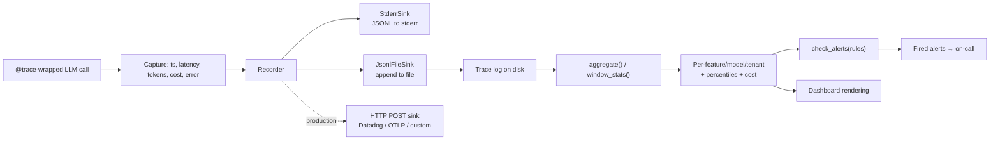
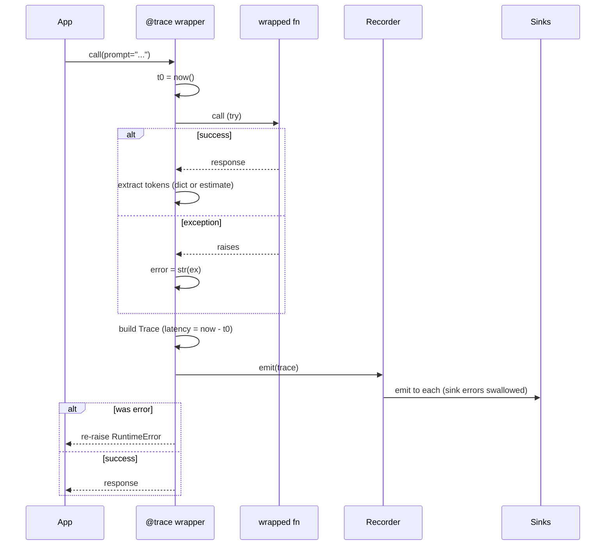
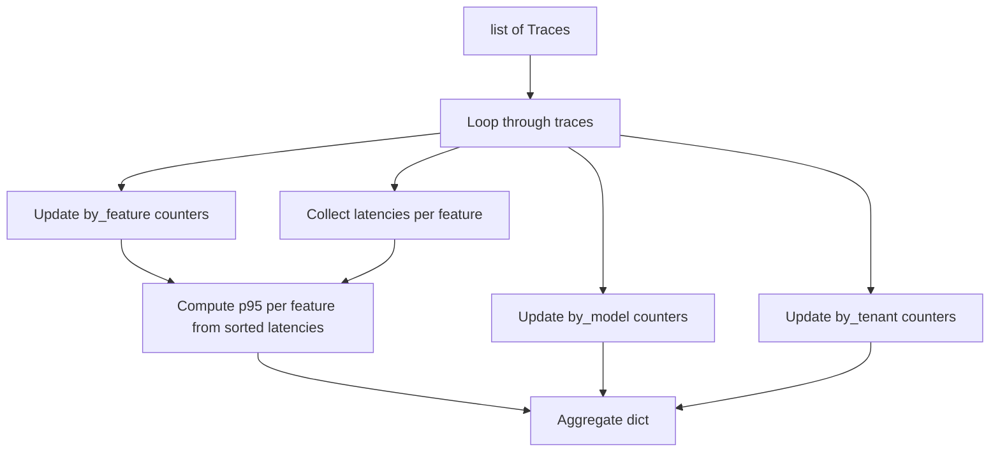
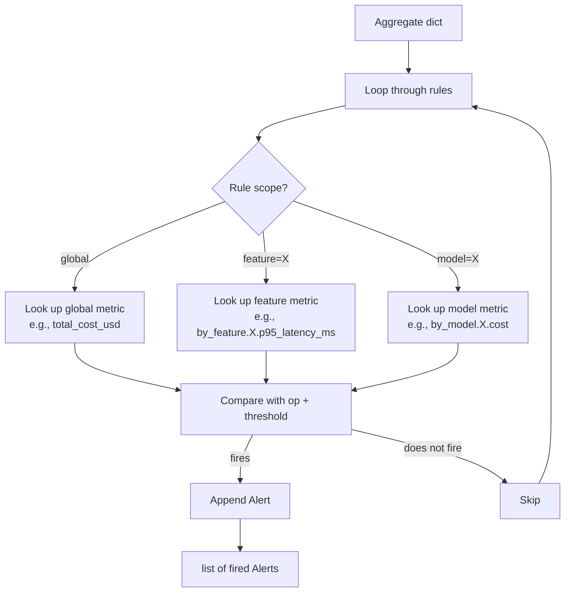
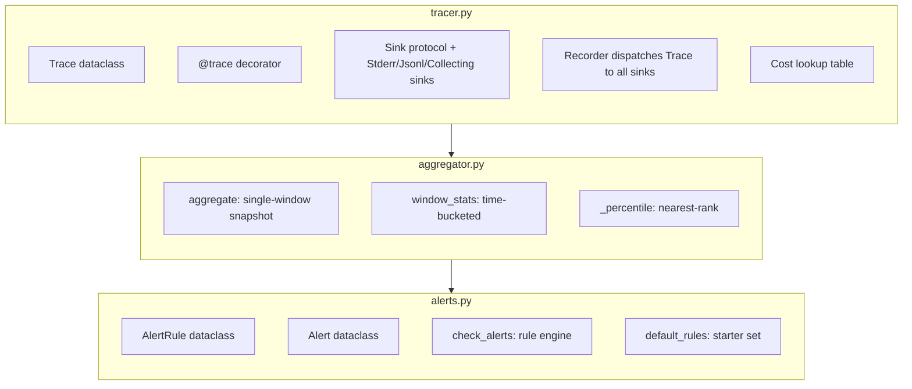
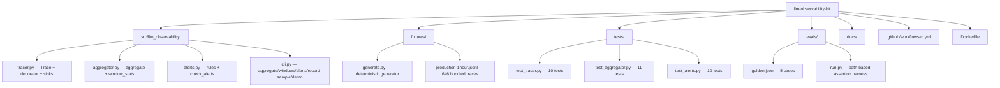

# Diagrams

GitHub renders Mermaid natively. These render on the README and here.

## End-to-end flow



## The @trace decorator



## Aggregator



## Sliding-window stats

```mermaid
flowchart TB
    T[list of Traces] --> S1[Sort by timestamp]
    S1 --> S2[Build N-minute windows<br/>from first ts to last ts]
    S2 --> S3[Bucket each trace into<br/>(window_idx, feature, model)]
    S3 --> S4[Per bucket: count, p50/p95/p99,<br/>error_count, cost, tokens]
    S4 --> W[list of WindowStats]
```

## Alert evaluation



## Component responsibilities



## Repo shape


